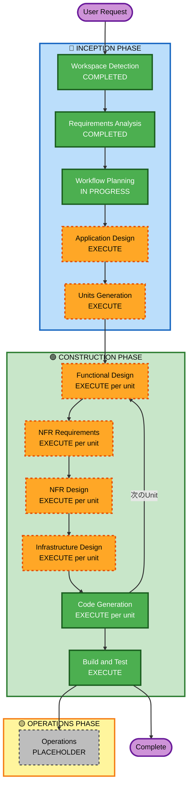

# Execution Plan — Works Logue

## Detailed Analysis Summary

### Change Impact Assessment
- **User-facing changes**: Yes — フルスタックWebアプリの新規構築
- **Structural changes**: Yes — 新規アーキテクチャ設計が必要
- **Data model changes**: Yes — Seed / Log / Louge / User / Score 等の新規スキーマ
- **API changes**: Yes — 新規API全設計
- **NFR impact**: Yes — AI処理（非同期）・リアルタイム更新・スコアリングロジック

### Risk Assessment
- **Risk Level**: Medium-High
- **主なリスク**: AI開花判定エンジンの複雑さ、Claude API統合、インサイト・スコア計算ロジック
- **Rollback Complexity**: N/A（新規プロジェクト）
- **Testing Complexity**: Moderate（AI統合のモック戦略が必要）

---

## Workflow Visualization

---

## Phases to Execute

### 🔵 INCEPTION PHASE

- [x] **Workspace Detection** — COMPLETED
  - Greenfield プロジェクト確認済み
- [x] **Reverse Engineering** — SKIPPED
  - 理由: Greenfield（既存コードなし）
- [x] **Requirements Analysis** — COMPLETED
  - フェーズ1スコープ・技術スタック・機能要件を確定
- [ ] **User Stories** — SKIPPED
  - 理由: ペルソナ（Seeker/Contributor）は要件書で整理済み。シンプルな2ペルソナ構成でストーリー追加価値が低い
- [x] **Workflow Planning** — IN PROGRESS（本ドキュメント）
- [ ] **Application Design** — **EXECUTE**
  - 理由: 新規コンポーネント多数（Seed・Log・Louge・ScoreEngine・AIService等）、サービス層設計が必要
- [ ] **Units Generation** — **EXECUTE**
  - 理由: 複雑なシステムを並行開発可能な単位に分解する必要がある（想定6ユニット）

### 🟢 CONSTRUCTION PHASE（Per-Unit Loop）

各ユニットに対して以下を実行:

- [ ] **Functional Design** — **EXECUTE**（per unit）
  - 理由: 新規データモデル・ビジネスロジック（開花判定・スコア計算）の詳細設計が必要
- [ ] **NFR Requirements** — **EXECUTE**（per unit）
  - 理由: AI処理の非同期性、Supabase Realtime、スコアリングのパフォーマンス考慮が必要
- [ ] **NFR Design** — **EXECUTE**（per unit）
  - 理由: NFR要件が存在するため
- [ ] **Infrastructure Design** — **EXECUTE**（per unit）
  - 理由: Vercel + Supabase の具体的なリソース設計・環境変数・デプロイ設定が必要
- [ ] **Code Generation** — **EXECUTE**（per unit、ALWAYS）
- [ ] **Build and Test** — **EXECUTE**（ALWAYS）

### 🟡 OPERATIONS PHASE

- [ ] **Operations** — PLACEHOLDER（将来拡張）

---

## 想定ユニット（Units Generation で詳細化）

| # | ユニット名 | 主な機能 |
|---|---|---|
| 1 | Auth & User Profile | 認証・ユーザー管理・プロフィール |
| 2 | Seed Core | Seed投稿・フィード・詳細表示 |
| 3 | Log & Discussion | Log投稿・スレッド・リアクション |
| 4 | Growth Engine | 成長ステージ管理・開花判定エンジン |
| 5 | AI Integration | Louge生成・知恵洗浄（Claude API） |
| 6 | Insight Score & Fork | スコア計算・バッジ・Fork機能 |

---

## Success Criteria

- **Primary Goal**: Works Logue フェーズ1を動作するWebアプリとして実装
- **Key Deliverables**:
  - Seed投稿・Log対話・成長ステージ可視化
  - AIによるLouge自動生成（Claude API）
  - インサイト・スコア・開花貢献者バッジ
  - Fork（再播種）機能
  - Vercel + Supabase デプロイ
- **Quality Gates**:
  - TypeScript strict モード
  - ユニットテスト（Vitest）
  - ビルド成功・デプロイ確認
