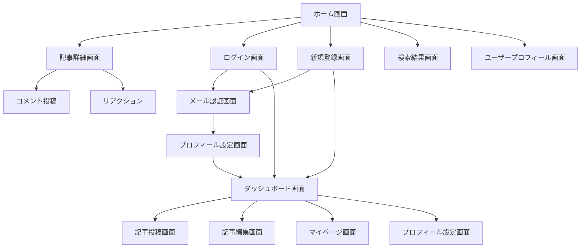
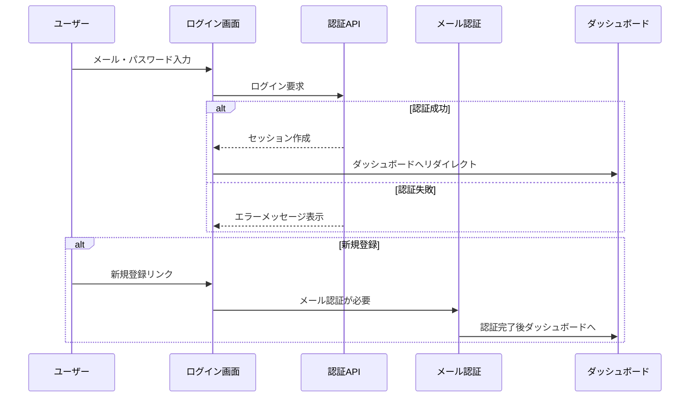

# Works Logue - 画面遷移・ナビゲーション

**バージョン**: 1.0  
**最終更新**: 2026年1月24日  
**ステータス**: 実装済み

## 1. 画面遷移図

### 1.1 全体遷移フロー



### 1.2 認証フロー



## 2. ルーティング設計

### 2.1 Next.js App Router構造

```
app/
├── (auth)/              # 認証グループ
│   ├── layout.tsx       # 認証レイアウト
│   ├── login/           # ログイン
│   │   └── page.tsx
│   └── signup/          # 新規登録
│       └── page.tsx
├── (private)/           # 認証必須グループ
│   ├── layout.tsx       # プライベートレイアウト
│   ├── dashboard/       # ダッシュボード
│   │   ├── page.tsx
│   │   └── articles/    # 記事管理
│   │       ├── page.tsx
│   │       ├── new/
│   │       └── [id]/
│   │           └── edit/
│   ├── mypage/          # マイページ
│   └── admin/           # 管理画面
└── (public)/            # 公開グループ
    ├── layout.tsx       # 公開レイアウト
    ├── page.tsx         # ホーム
    ├── [userId]/        # ユーザープロフィール
    │   ├── page.tsx
    │   └── articles/    # ユーザー記事一覧
    │       └── [articleId]/
    ├── search/          # 検索
    └── topics/          # トピック一覧
        └── [topicId]/
```

### 2.2 URLパターン

| パス                             | 画面                 | 認証 | 説明               |
| -------------------------------- | -------------------- | ---- | ------------------ |
| `/`                              | ホーム画面           | 不要 | 最新記事一覧       |
| `/login`                         | ログイン画面         | 不要 | ユーザーログイン   |
| `/signup`                        | 新規登録画面         | 不要 | アカウント作成     |
| `/dashboard`                     | ダッシュボード       | 必要 | 個人管理画面       |
| `/dashboard/articles`            | 記事管理             | 必要 | 自分の記事一覧     |
| `/dashboard/articles/new`        | 記事投稿             | 必要 | 新規記事作成       |
| `/dashboard/articles/[id]/edit`  | 記事編集             | 必要 | 記事内容編集       |
| `/mypage`                        | マイページ           | 必要 | プロフィール表示   |
| `/[userId]`                      | ユーザープロフィール | 不要 | 他ユーザーの情報   |
| `/[userId]/articles/[articleId]` | 記事詳細             | 不要 | 記事コンテンツ表示 |
| `/search`                        | 検索結果             | 不要 | 検索結果表示       |
| `/topics/[topicId]`              | トピック記事         | 不要 | トピック別記事一覧 |

## 3. ナビゲーション設計

### 3.1 共通ナビゲーション

#### 3.1.1 ヘッダーナビゲーション

```tsx
// 実装: src/widgets/header/ui/Header.tsx
<header className="border-b">
  <div className="flex items-center justify-between px-4 py-2">
    {/* ロゴ・ホームリンク */}
    <Link href="/" className="flex items-center gap-2">
      <Logo />
      <span className="text-xl font-bold">Works Logue</span>
    </Link>

    {/* 検索バー */}
    <SearchForm className="flex-1 max-w-md mx-4" />

    {/* ユーザーメニュー */}
    <div className="flex items-center gap-2">
      <ThemeToggle />
      {session ? (
        <UserMenu user={session.user} />
      ) : (
        <div className="flex gap-2">
          <Button asChild variant="outline">
            <Link href="/login">ログイン</Link>
          </Button>
          <Button asChild>
            <Link href="/signup">新規登録</Link>
          </Button>
        </div>
      )}
    </div>
  </div>
</header>
```

#### 3.1.2 ユーザーメニュー

```tsx
// ログイン済みユーザー向けドロップダウンメニュー
<DropdownMenu>
  <DropdownMenuTrigger asChild>
    <Button variant="ghost" className="relative w-8 h-8 rounded-full">
      <Avatar>
        <AvatarImage src={user.image} />
        <AvatarFallback>{user.displayName?.[0]}</AvatarFallback>
      </Avatar>
    </Button>
  </DropdownMenuTrigger>
  <DropdownMenuContent align="end">
    <DropdownMenuItem asChild>
      <Link href="/dashboard">ダッシュボード</Link>
    </DropdownMenuItem>
    <DropdownMenuItem asChild>
      <Link href="/mypage">マイページ</Link>
    </DropdownMenuItem>
    <DropdownMenuItem asChild>
      <Link href="/dashboard/articles/new">記事を書く</Link>
    </DropdownMenuItem>
    <DropdownMenuSeparator />
    <DropdownMenuItem onClick={() => signOut()}>ログアウト</DropdownMenuItem>
  </DropdownMenuContent>
</DropdownMenu>
```

### 3.2 サイドナビゲーション

#### 3.2.1 ダッシュボードサイドバー

```tsx
// 実装: src/widgets/sidebar/ui/DashboardSidebar.tsx
<aside className="w-64 border-r bg-card">
  <nav className="p-4">
    <ul className="space-y-2">
      <li>
        <Link
          href="/dashboard"
          className={cn("flex items-center gap-2 px-3 py-2 rounded-md", {
            "bg-primary text-primary-foreground": pathname === "/dashboard",
          })}
        >
          <HomeIcon className="w-4 h-4" />
          ダッシュボード
        </Link>
      </li>
      <li>
        <Link
          href="/dashboard/articles"
          className={cn("flex items-center gap-2 px-3 py-2 rounded-md", {
            "bg-primary text-primary-foreground": pathname.startsWith(
              "/dashboard/articles",
            ),
          })}
        >
          <FileTextIcon className="w-4 h-4" />
          記事管理
        </Link>
      </li>
      <li>
        <Link href="/dashboard/articles/new">
          <Button className="w-full justify-start">
            <PlusIcon className="w-4 h-4 mr-2" />
            記事を書く
          </Button>
        </Link>
      </li>
    </ul>
  </nav>
</aside>
```

#### 3.2.2 トピック・タグサイドバー

```tsx
// 実装: src/widgets/sidebar/ui/TopicSidebar.tsx
<aside className="w-64">
  <div className="p-4 space-y-4">
    {/* トピック一覧 */}
    <div>
      <h3 className="font-semibold mb-2">トピック</h3>
      <ul className="space-y-1">
        {topics.map((topic) => (
          <li key={topic.id}>
            <Link
              href={`/topics/${topic.id}`}
              className="block px-2 py-1 text-sm hover:bg-accent rounded-md"
            >
              {topic.name}
            </Link>
          </li>
        ))}
      </ul>
    </div>

    {/* 人気タグ */}
    <div>
      <h3 className="font-semibold mb-2">人気のタグ</h3>
      <div className="flex flex-wrap gap-1">
        {popularTags.map((tag) => (
          <Badge key={tag.id} variant="secondary">
            {tag.name}
          </Badge>
        ))}
      </div>
    </div>
  </div>
</aside>
```

## 4. リダイレクト・認証制御

### 4.1 認証ミドルウェア

```typescript
// 実装: middleware.ts
import { withAuth } from "next-auth/middleware";

export default withAuth(
  function middleware(req) {
    // 管理者権限が必要なページ
    if (req.nextUrl.pathname.startsWith("/admin")) {
      if (req.nextauth.token?.role !== "ADMIN") {
        return NextResponse.redirect(new URL("/dashboard", req.url));
      }
    }
  },
  {
    callbacks: {
      authorized: ({ token, req }) => {
        // 認証が必要なパス
        if (req.nextUrl.pathname.startsWith("/dashboard")) {
          return !!token;
        }
        if (req.nextUrl.pathname.startsWith("/mypage")) {
          return !!token;
        }
        return true;
      },
    },
  },
);

export const config = {
  matcher: ["/dashboard/:path*", "/mypage/:path*", "/admin/:path*"],
};
```

### 4.2 リダイレクト設定

#### 4.2.1 認証後リダイレクト

```typescript
// 実装: src/app/auth.config.ts
export const authConfig = {
  pages: {
    signIn: "/login",
    signUp: "/signup",
    error: "/auth/error",
  },
  callbacks: {
    authorized({ auth, request: { nextUrl } }) {
      const isLoggedIn = !!auth?.user;
      const isOnDashboard = nextUrl.pathname.startsWith("/dashboard");

      if (isOnDashboard) {
        if (isLoggedIn) return true;
        return false; // ログインページにリダイレクト
      } else if (isLoggedIn) {
        // ログイン済みの場合、認証ページからダッシュボードへ
        if (
          nextUrl.pathname.startsWith("/login") ||
          nextUrl.pathname.startsWith("/signup")
        ) {
          return Response.redirect(new URL("/dashboard", nextUrl));
        }
      }

      return true;
    },
  },
};
```

#### 4.2.2 新規登録後フロー

```typescript
// 新規登録 → メール認証 → プロフィール設定 → ダッシュボード
const signupFlow = {
  1: "/auth/verify-email", // メール認証待ち
  2: "/welcome", // プロフィール初期設定
  3: "/dashboard", // ダッシュボードへ
};
```

## 5. パンくずナビゲーション

### 5.1 動的パンくず生成

```tsx
// 実装: src/widgets/breadcrumb/ui/Breadcrumb.tsx
interface BreadcrumbItem {
  label: string;
  href?: string;
}

export function Breadcrumb({ items }: { items: BreadcrumbItem[] }) {
  return (
    <nav className="flex items-center space-x-1 text-sm text-muted-foreground">
      <Link href="/" className="hover:text-foreground">
        ホーム
      </Link>
      {items.map((item, index) => (
        <Fragment key={index}>
          <ChevronRightIcon className="w-4 h-4" />
          {item.href ? (
            <Link href={item.href} className="hover:text-foreground">
              {item.label}
            </Link>
          ) : (
            <span className="text-foreground">{item.label}</span>
          )}
        </Fragment>
      ))}
    </nav>
  );
}
```

### 5.2 パンくず設定例

```typescript
// ページ別パンくず設定
const breadcrumbConfig = {
  "/dashboard": [{ label: "ダッシュボード" }],
  "/dashboard/articles": [
    { label: "ダッシュボード", href: "/dashboard" },
    { label: "記事管理" },
  ],
  "/dashboard/articles/new": [
    { label: "ダッシュボード", href: "/dashboard" },
    { label: "記事管理", href: "/dashboard/articles" },
    { label: "記事投稿" },
  ],
  "/[userId]/articles/[articleId]": [
    { label: "記事一覧", href: "/" },
    { label: user.displayName, href: `/${user.userId}` },
    { label: article.title },
  ],
};
```

## 6. モバイル対応ナビゲーション

### 6.1 ハンバーガーメニュー

```tsx
// 実装: src/widgets/header/ui/MobileNav.tsx
export function MobileNav() {
  const [isOpen, setIsOpen] = useState(false);

  return (
    <>
      <Button
        variant="ghost"
        className="md:hidden"
        onClick={() => setIsOpen(true)}
      >
        <MenuIcon className="w-6 h-6" />
      </Button>

      <Sheet open={isOpen} onOpenChange={setIsOpen}>
        <SheetContent side="left">
          <nav className="flex flex-col space-y-4">
            <Link href="/" onClick={() => setIsOpen(false)}>
              ホーム
            </Link>
            <Link href="/search" onClick={() => setIsOpen(false)}>
              検索
            </Link>
            {session ? (
              <>
                <Link href="/dashboard" onClick={() => setIsOpen(false)}>
                  ダッシュボード
                </Link>
                <Link href="/mypage" onClick={() => setIsOpen(false)}>
                  マイページ
                </Link>
                <Button variant="outline" onClick={() => signOut()}>
                  ログアウト
                </Button>
              </>
            ) : (
              <>
                <Link href="/login" onClick={() => setIsOpen(false)}>
                  ログイン
                </Link>
                <Link href="/signup" onClick={() => setIsOpen(false)}>
                  新規登録
                </Link>
              </>
            )}
          </nav>
        </SheetContent>
      </Sheet>
    </>
  );
}
```

### 6.2 タブレット対応

```css
/* レスポンシブナビゲーション */
@media (max-width: 1024px) {
  .sidebar {
    transform: translateX(-100%);
    transition: transform 0.3s ease;
  }

  .sidebar.open {
    transform: translateX(0);
  }
}

@media (max-width: 640px) {
  .header-search {
    display: none;
  }

  .mobile-search {
    display: block;
  }
}
```

---

## 変更履歴

| 日付       | バージョン | 変更者   | 変更内容                                             |
| ---------- | ---------- | -------- | ---------------------------------------------------- |
| 2026-01-24 | 1.0        | システム | 外部設計書から画面遷移・ナビゲーションを分離・独立化 |
