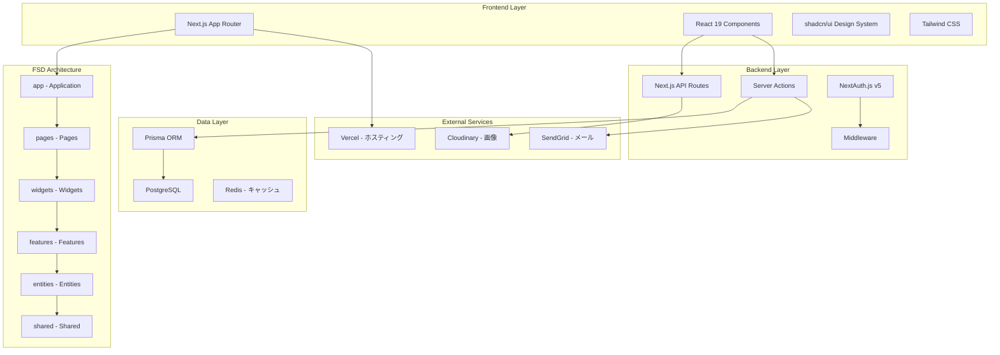
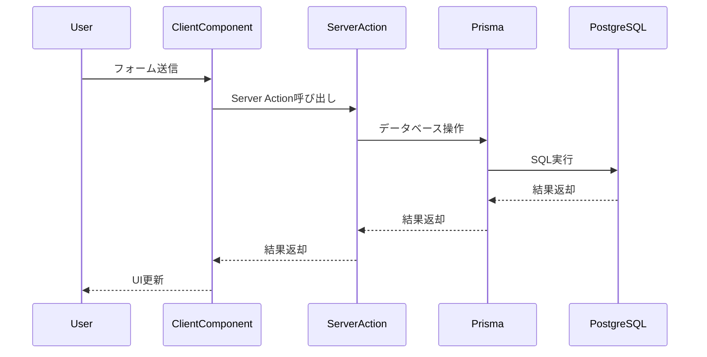

# Works Logue - システムアーキテクチャ

**バージョン**: 1.0  
**最終更新**: 2026年1月24日  
**ステータス**: 実装済み

## 1. 全体アーキテクチャ

### 1.1 システム全体構成



### 1.2 アーキテクチャ要素

| レイヤー     | 技術要素                           | 責務                                       | 実装状況    |
| ------------ | ---------------------------------- | ------------------------------------------ | ----------- |
| **Frontend** | Next.js 15.5.9 + React 19          | ユーザーインターフェース、クライアント処理 | ✅ 完了     |
| **FSD**      | Feature-Sliced Design              | コード構造、モジュール分離                 | ✅ 完了     |
| **Backend**  | Next.js API Routes, Server Actions | サーバーサイド処理、認証                   | ✅ 完了     |
| **Data**     | Prisma ORM + PostgreSQL            | データ永続化、データベース操作             | ✅ 完了     |
| **External** | Cloudinary, SendGrid, Vercel       | 外部サービス統合                           | 🔄 部分実装 |

## 2. Feature-Sliced Design (FSD) アーキテクチャ

### 2.1 レイヤー構成詳細

```
src/
├── app/           # アプリケーション起動レイヤー
│   ├── providers/
│   │   ├── AuthProvider.tsx      # 認証状態管理
│   │   ├── ThemeProvider.tsx     # テーマ管理
│   │   └── index.ts
│   ├── layout/
│   │   ├── AppLayout.tsx         # アプリケーションレイアウト
│   │   └── index.ts
│   ├── styles/
│   │   ├── globals.css           # グローバルスタイル
│   │   └── index.ts
│   └── config/
│       ├── database.ts           # データベース設定
│       └── index.ts
│
├── pages/         # ページコンポーネントレイヤー
│   ├── home-page/
│   │   ├── ui/HomePage.tsx
│   │   └── index.ts
│   ├── login-page/
│   ├── article-detail-page/
│   └── index.ts
│
├── widgets/       # 独立したUIブロックレイヤー
│   ├── header/
│   │   ├── ui/Header.tsx
│   │   └── index.ts
│   ├── article-list/
│   ├── article-detail/
│   └── index.ts
│
├── features/      # ユーザー機能レイヤー
│   ├── auth/
│   │   ├── ui/LoginForm.tsx
│   │   ├── api/actions.ts
│   │   └── index.ts
│   ├── article-editor/
│   ├── article-reaction/
│   └── index.ts
│
├── entities/      # ビジネスエンティティレイヤー
│   ├── article/
│   │   ├── api/queries.ts
│   │   ├── api/mutations.ts
│   │   ├── model/types.ts
│   │   └── index.ts
│   ├── user/
│   ├── comment/
│   └── index.ts
│
└── shared/        # 共通リソースレイヤー
    ├── ui/
    │   ├── shadcn/              # shadcn/ui コンポーネント
    │   │   ├── button.tsx
    │   │   ├── card.tsx
    │   │   └── index.ts
    │   └── index.ts
    ├── lib/
    │   ├── prisma.ts            # Prismaクライアント
    │   ├── auth.ts              # 認証設定
    │   ├── utils.ts             # ユーティリティ関数
    │   └── index.ts
    ├── config/
    │   ├── constants.ts         # 定数定義
    │   └── index.ts
    └── index.ts
```

### 2.2 公開API設計パターン

#### 2.2.1 レイヤー間インポートルール

```typescript
// ✅ 正しいインポート（公開API経由）
import { HomePage } from "@/pages";
import { Header, ArticleList } from "@/widgets";
import { LoginForm, authenticate } from "@/features";
import { getArticleById, type Article } from "@/entities";
import { Button, Card, prisma, cn } from "@/shared";

// ❌ 禁止（内部構造への直接アクセス）
import { HomePage } from "@/pages/home-page/ui/HomePage";
import { Header } from "@/widgets/header/ui/Header";
```

#### 2.2.2 公開API実装例

```typescript
// src/entities/index.ts
export {
  getArticleById,
  createArticle,
  updateArticle,
  deleteArticle,
  type Article,
  type ArticleWithDetails,
  type ArticleCreateInput,
} from "./article";

export {
  getUserById,
  updateUserProfile,
  type User,
  type UserProfile,
  type UserPublicInfo,
} from "./user";

export {
  getCommentsByArticle,
  createComment,
  type Comment,
  type CommentWithReplies,
} from "./comment";

// src/features/index.ts
export { LoginForm, SignupForm } from "./auth";
export { ArticleEditor } from "./article-editor";
export { ArticleReactions } from "./article-reaction";
export { CommentSystem } from "./comment-system";

// src/widgets/index.ts
export { Header } from "./header";
export { ArticleList } from "./article-list";
export { ArticleDetail } from "./article-detail";
export { Sidebar } from "./sidebar";

// src/shared/index.ts
export { Button, Card, Input, Badge, Alert } from "./ui/shadcn";
export { cn, formatDate, formatNumber, slugify } from "./lib";
export { prisma } from "./lib/prisma";
export { APP_CONFIG, API_ENDPOINTS } from "./config";
```

## 3. Next.js App Router 統合パターン

### 3.1 ファイルベースルーティング統合

#### 3.1.1 App Router ディレクトリ構造

```
app/               # Next.js App Router（ファイルベースルーティング）
├── layout.tsx     # ルートレイアウト - FSD App レイヤーを統合
├── page.tsx       # ホームページ - FSD Pages レイヤーを使用
├── loading.tsx    # グローバルローディング
├── error.tsx      # グローバルエラー
├── not-found.tsx  # 404ページ
├── (auth)/        # 認証ページグループ
│   ├── layout.tsx # 認証専用レイアウト
│   ├── login/
│   │   └── page.tsx
│   └── signup/
│       └── page.tsx
├── (private)/     # 認証必須ページグループ
│   ├── layout.tsx # 認証チェック + プライベートレイアウト
│   ├── dashboard/
│   │   ├── page.tsx
│   │   └── articles/
│   │       ├── page.tsx
│   │       ├── new/
│   │       └── [id]/
│   │           └── edit/
│   ├── mypage/
│   └── admin/
├── (public)/      # 公開ページグループ
│   ├── layout.tsx # 公開レイアウト
│   ├── page.tsx   # ホーム（重複回避のためリダイレクト）
│   ├── search/
│   ├── topics/
│   └── [userId]/
│       ├── page.tsx
│       └── articles/
│           └── [articleId]/
└── api/           # API Routes
    ├── auth/      # NextAuth.js
    ├── articles/  # 記事関連API
    ├── upload/    # ファイルアップロード
    └── search/    # 検索API
```

#### 3.1.2 統合実装例

```typescript
// app/layout.tsx - Next.js App Router のルートレイアウト
import { AppLayout } from "@/app";
import type { Metadata } from "next";

export const metadata: Metadata = {
  title: "Works Logue",
  description: "技術記事共有プラットフォーム",
};

export default function RootLayout({
  children,
}: {
  children: React.ReactNode;
}) {
  return (
    <html lang="ja" suppressHydrationWarning>
      <body>
        <AppLayout>{children}</AppLayout>
      </body>
    </html>
  );
}

// app/(public)/page.tsx - Next.js App Router のホームページ
import { HomePage } from "@/pages";

export default function Page() {
  return <HomePage />;
}

// src/app/layout/AppLayout.tsx - FSD App レイヤーの統合レイアウト
import { AuthProvider, ThemeProvider } from "@/app/providers";

export function AppLayout({ children }: { children: React.ReactNode }) {
  return (
    <ThemeProvider>
      <AuthProvider>
        <div className="min-h-screen bg-background">
          {children}
        </div>
      </AuthProvider>
    </ThemeProvider>
  );
}

// src/pages/home-page/ui/HomePage.tsx - FSD Pages レイヤー
import { Header } from "@/widgets";
import { ArticleList } from "@/widgets";

export function HomePage() {
  return (
    <>
      <Header />
      <main className="container mx-auto px-4 py-8">
        <ArticleList />
      </main>
    </>
  );
}
```

### 3.2 Server Components/Client Components 戦略

#### 3.2.1 コンポーネント分類

| 種類                 | 用途                        | 実装方針       | 例                                  |
| -------------------- | --------------------------- | -------------- | ----------------------------------- |
| **Server Component** | データフェッチ、SEO         | デフォルト選択 | ページ、記事一覧、静的ヘッダー      |
| **Client Component** | インタラクション、状態管理  | 必要な場合のみ | フォーム、ボタン、テーマ切り替え    |
| **Hybrid**           | サーバー + クライアント混合 | 適切に分離     | 記事詳細（静的部分 + リアクション） |

#### 3.2.2 実装パターン

```typescript
// Server Component - データフェッチ含むページコンポーネント
// src/pages/article-detail-page/ui/ArticleDetailPage.tsx
import { getArticleById } from "@/entities";
import { ArticleDetail } from "@/widgets";

interface ArticleDetailPageProps {
  userId: string;
  articleId: string;
}

export async function ArticleDetailPage({ userId, articleId }: ArticleDetailPageProps) {
  // サーバーサイドでデータフェッチ
  const article = await getArticleById(articleId);

  if (!article) {
    notFound();
  }

  return (
    <div className="container mx-auto px-4 py-8">
      <ArticleDetail article={article} />
    </div>
  );
}

// Client Component - インタラクティブな機能
// src/features/article-reaction/ui/ArticleReactions.tsx
"use client";

import { useState, useTransition } from "react";
import { Button } from "@/shared";

interface ArticleReactionsProps {
  articleId: string;
  initialLikeCount: number;
  initialIsLiked: boolean;
}

export function ArticleReactions({
  articleId,
  initialLikeCount,
  initialIsLiked
}: ArticleReactionsProps) {
  const [isPending, startTransition] = useTransition();
  const [likeCount, setLikeCount] = useState(initialLikeCount);
  const [isLiked, setIsLiked] = useState(initialIsLiked);

  const handleLike = () => {
    startTransition(async () => {
      // Server Action呼び出し
      const result = await toggleArticleLike(articleId);
      if (result.success) {
        setLikeCount(result.likeCount);
        setIsLiked(result.isLiked);
      }
    });
  };

  return (
    <Button
      onClick={handleLike}
      disabled={isPending}
      variant={isLiked ? "default" : "outline"}
    >
      ❤️ {likeCount}
    </Button>
  );
}
```

## 4. データフロー設計

### 4.1 データフローパターン

#### 4.1.1 Server Actions + Server Components



#### 4.1.2 実装例：記事作成フロー

```typescript
// Server Action - src/entities/article/api/actions.ts
import { revalidatePath } from "next/cache";
import { redirect } from "next/navigation";

export async function createArticle(prevState: any, formData: FormData) {
  try {
    // 認証チェック
    const session = await getServerSession(authOptions);
    if (!session?.user) {
      return { error: "認証が必要です" };
    }

    // バリデーション
    const validatedData = createArticleSchema.parse({
      title: formData.get("title"),
      content: formData.get("content"),
      topicId: formData.get("topicId"),
    });

    // データベース操作
    const article = await prisma.article.create({
      data: {
        ...validatedData,
        authorId: session.user.id,
        status: "PUBLISHED",
      },
    });

    // キャッシュ無効化
    revalidatePath("/dashboard/articles");
    revalidatePath("/");

    // リダイレクト
    redirect(`/${session.user.userId}/articles/${article.id}`);
  } catch (error) {
    return { error: "記事の作成に失敗しました" };
  }
}

// Client Component - src/features/article-editor/ui/ArticleEditor.tsx
"use client";

import { useFormState } from "react-dom";
import { createArticle } from "@/entities";

export function ArticleEditor() {
  const [state, action] = useFormState(createArticle, { error: null });

  return (
    <form action={action}>
      <input name="title" placeholder="タイトル" />
      <textarea name="content" placeholder="内容" />
      <button type="submit">投稿</button>
      {state.error && <p className="text-red-500">{state.error}</p>}
    </form>
  );
}
```

### 4.2 状態管理戦略

#### 4.2.1 状態分類

| 状態種類           | 管理方法          | 実装場所             | 例                         |
| ------------------ | ----------------- | -------------------- | -------------------------- |
| **グローバル状態** | React Context     | `src/app/providers/` | 認証状態、テーマ           |
| **サーバー状態**   | Server Components | Prisma Query         | 記事データ、ユーザー情報   |
| **ローカル状態**   | useState          | Component内          | フォーム状態、UI状態       |
| **URL状態**        | Next.js Router    | searchParams         | 検索条件、ページネーション |

#### 4.2.2 グローバル状態実装

```typescript
// src/app/providers/AuthProvider.tsx
"use client";

import { createContext, useContext } from "react";
import { useSession } from "next-auth/react";

interface AuthContextType {
  user: User | null;
  isLoading: boolean;
  isAuthenticated: boolean;
}

const AuthContext = createContext<AuthContextType | null>(null);

export function AuthProvider({ children }: { children: React.ReactNode }) {
  const { data: session, status } = useSession();

  const value = {
    user: session?.user || null,
    isLoading: status === "loading",
    isAuthenticated: !!session?.user,
  };

  return (
    <AuthContext.Provider value={value}>
      {children}
    </AuthContext.Provider>
  );
}

export function useAuth() {
  const context = useContext(AuthContext);
  if (!context) {
    throw new Error("useAuth must be used within AuthProvider");
  }
  return context;
}
```

---

## 変更履歴

| 日付       | バージョン | 変更者   | 変更内容                                   |
| ---------- | ---------- | -------- | ------------------------------------------ |
| 2026-01-24 | 1.0        | システム | 内部設計書からアーキテクチャを分離・独立化 |
