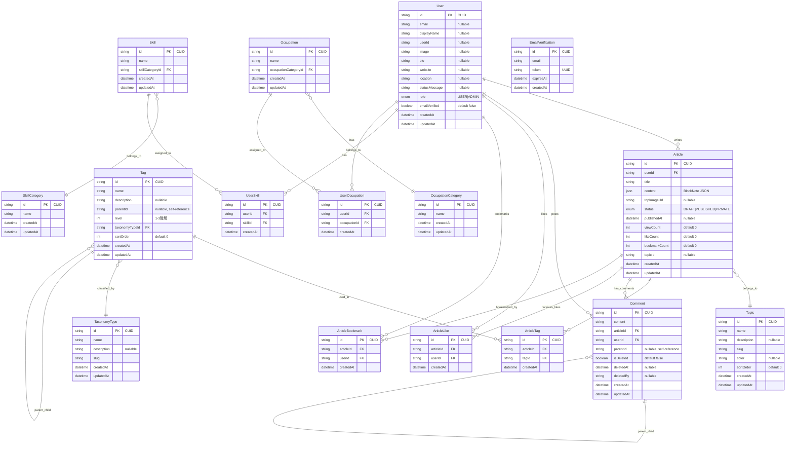

# Works Logue - データベース設計

**バージョン**: 1.0  
**最終更新**: 2026年1月24日  
**ステータス**: 実装済み

## 1. データベース概要

### 1.1 基本構成
- **RDBMS**: PostgreSQL 14+
- **ORM**: Prisma 6.19.1
- **接続プール**: Prismaによる管理
- **マイグレーション**: Prisma Migrate

### 1.2 設計原則
- **正規化**: 第3正規形まで正規化
- **パフォーマンス**: 適切なインデックス設計
- **拡張性**: 将来の機能拡張を考慮
- **整合性**: 外部キー制約による参照整合性

## 2. ER図・テーブル構成

### 2.1 ER図



### 2.2 主要テーブル詳細設計

#### 2.2.1 User（ユーザー）テーブル
```sql
CREATE TABLE "User" (
  "id" TEXT PRIMARY KEY,              -- CUID（グローバルユニーク）
  "email" TEXT UNIQUE,                -- メールアドレス（OAuth用に nullable）
  "password" TEXT,                    -- bcryptハッシュ化パスワード
  "displayName" TEXT,                 -- 表示名（ユーザーが設定）
  "userId" TEXT UNIQUE,               -- ユーザーID（@username、URL用）
  "bio" TEXT,                         -- 自己紹介文
  "image" TEXT,                       -- プロフィール画像URL
  "coverImage" TEXT,                  -- カバー画像URL
  "website" TEXT,                     -- ウェブサイトURL
  "twitter" TEXT,                     -- TwitterアカウントID
  "github" TEXT,                      -- GitHubアカウントID
  "location" TEXT,                    -- 所在地
  "statusMessage" TEXT,               -- ステータスメッセージ
  "role" "UserRole" DEFAULT 'USER',   -- ロール（USER, ADMIN）
  "emailVerified" BOOLEAN DEFAULT false, -- メール認証状態
  "emailVerifiedAt" TIMESTAMP,        -- メール認証日時
  "lastLoginAt" TIMESTAMP,            -- 最終ログイン日時
  "createdAt" TIMESTAMP DEFAULT NOW(),
  "updatedAt" TIMESTAMP DEFAULT NOW()
);

-- インデックス
CREATE INDEX "User_email_idx" ON "User"("email");
CREATE INDEX "User_userId_idx" ON "User"("userId");
CREATE INDEX "User_role_idx" ON "User"("role");
```

**制約・特徴**:
- `id`: CUID形式（例: `clz1a2b3c000000000example`）
- `email`: OAuth認証対応のため nullable
- `userId`: URL用（例: `/yamada_taro`）
- パスワードは bcryptjs でハッシュ化

#### 2.2.2 Article（記事）テーブル
```sql
CREATE TABLE "Article" (
  "id" TEXT PRIMARY KEY,              -- CUID
  "userId" TEXT NOT NULL REFERENCES "User"("id") ON DELETE CASCADE,
  "title" TEXT NOT NULL,              -- 記事タイトル
  "slug" TEXT,                        -- URL用スラッグ（自動生成）
  "content" JSONB,                    -- BlockNote JSON形式コンテンツ
  "excerpt" TEXT,                     -- 抜粋（自動生成または手動）
  "topImageUrl" TEXT,                 -- トップ画像URL
  "status" "ArticleStatus" DEFAULT 'DRAFT', -- ステータス
  "publishedAt" TIMESTAMP,            -- 公開日時
  "viewCount" INTEGER DEFAULT 0,      -- 閲覧数（キャッシュ）
  "likeCount" INTEGER DEFAULT 0,      -- いいね数（キャッシュ）
  "bookmarkCount" INTEGER DEFAULT 0,  -- ブックマーク数（キャッシュ）
  "commentCount" INTEGER DEFAULT 0,   -- コメント数（キャッシュ）
  "topicId" TEXT REFERENCES "Topic"("id") ON DELETE SET NULL,
  "createdAt" TIMESTAMP DEFAULT NOW(),
  "updatedAt" TIMESTAMP DEFAULT NOW()
);

-- インデックス
CREATE INDEX "Article_userId_idx" ON "Article"("userId");
CREATE INDEX "Article_status_idx" ON "Article"("status");
CREATE INDEX "Article_published_idx" ON "Article"("status", "publishedAt" DESC);
CREATE INDEX "Article_topicId_idx" ON "Article"("topicId");
CREATE INDEX "Article_slug_idx" ON "Article"("slug");

-- 全文検索用インデックス（PostgreSQL）
CREATE INDEX "Article_title_search_idx" ON "Article" USING GIN (to_tsvector('japanese', "title"));
CREATE INDEX "Article_content_search_idx" ON "Article" USING GIN (to_tsvector('japanese', "content"::text));
```

**制約・特徴**:
- `content`: BlockNote の JSON 形式で保存
- `status`: DRAFT（下書き）、PUBLISHED（公開）、PRIVATE（非公開）
- カウント値はパフォーマンス最適化のためキャッシュ

#### 2.2.3 Comment（コメント）テーブル（階層構造）
```sql
CREATE TABLE "Comment" (
  "id" TEXT PRIMARY KEY,              -- CUID
  "content" TEXT NOT NULL,            -- コメント内容（Markdown対応）
  "articleId" TEXT NOT NULL REFERENCES "Article"("id") ON DELETE CASCADE,
  "userId" TEXT NOT NULL REFERENCES "User"("id") ON DELETE CASCADE,
  "parentId" TEXT REFERENCES "Comment"("id") ON DELETE CASCADE, -- 階層用親コメント
  "level" INTEGER DEFAULT 0,          -- 階層レベル（0=トップレベル, 1=返信, 2=返信の返信）
  "isDeleted" BOOLEAN DEFAULT false,  -- 論理削除フラグ
  "deletedAt" TIMESTAMP,              -- 削除日時
  "deletedBy" TEXT REFERENCES "User"("id"), -- 削除者（管理者削除の場合）
  "createdAt" TIMESTAMP DEFAULT NOW(),
  "updatedAt" TIMESTAMP DEFAULT NOW()
);

-- インデックス
CREATE INDEX "Comment_articleId_idx" ON "Comment"("articleId");
CREATE INDEX "Comment_userId_idx" ON "Comment"("userId");
CREATE INDEX "Comment_parentId_idx" ON "Comment"("parentId");
CREATE INDEX "Comment_article_created_idx" ON "Comment"("articleId", "createdAt");
```

**制約・特徴**:
- 階層コメント：最大3階層まで
- 論理削除：`isDeleted` フラグで管理
- `level` で階層深度を管理（パフォーマンス最適化）

#### 2.2.4 Tag（タグ）テーブル（階層構造）
```sql
CREATE TABLE "Tag" (
  "id" TEXT PRIMARY KEY,              -- CUID
  "name" TEXT NOT NULL,               -- タグ名
  "description" TEXT,                 -- タグ説明
  "slug" TEXT,                        -- URL用スラッグ
  "parentId" TEXT REFERENCES "Tag"("id") ON DELETE CASCADE, -- 階層用親タグ
  "level" INTEGER DEFAULT 1,          -- 階層レベル（1=業界, 2=サブ業界, 3=詳細技術）
  "taxonomyTypeId" TEXT NOT NULL REFERENCES "TaxonomyType"("id"),
  "sortOrder" INTEGER DEFAULT 0,      -- 表示順序
  "color" TEXT,                       -- 表示色（HEXカラー）
  "isActive" BOOLEAN DEFAULT true,    -- 有効フラグ
  "createdAt" TIMESTAMP DEFAULT NOW(),
  "updatedAt" TIMESTAMP DEFAULT NOW()
);

-- インデックス・制約
CREATE UNIQUE INDEX "Tag_name_parent_unique" ON "Tag"("name", "parentId"); -- 同一親下で名前重複防止
CREATE INDEX "Tag_taxonomyTypeId_idx" ON "Tag"("taxonomyTypeId");
CREATE INDEX "Tag_parentId_idx" ON "Tag"("parentId");
CREATE INDEX "Tag_slug_idx" ON "Tag"("slug");
CREATE INDEX "Tag_level_order_idx" ON "Tag"("level", "sortOrder");
```

**階層例**:
```
業界（level 1）
├── フロントエンド（level 2）
│   ├── React（level 3）
│   ├── Vue.js（level 3）
│   └── Angular（level 3）
└── バックエンド（level 2）
    ├── Node.js（level 3）
    ├── Python（level 3）
    └── Java（level 3）
```

### 2.3 マスターデータ設計

#### 2.3.1 TaxonomyType（タクソノミータイプ）
```sql
CREATE TABLE "TaxonomyType" (
  "id" TEXT PRIMARY KEY,
  "name" TEXT NOT NULL,               -- 分類名（例：「技術」「業界」「職種」）
  "description" TEXT,
  "slug" TEXT UNIQUE NOT NULL,        -- URL用（例：technology, industry）
  "sortOrder" INTEGER DEFAULT 0,
  "isActive" BOOLEAN DEFAULT true,
  "createdAt" TIMESTAMP DEFAULT NOW(),
  "updatedAt" TIMESTAMP DEFAULT NOW()
);

-- 初期データ例
INSERT INTO "TaxonomyType" ("id", "name", "slug") VALUES 
('taxonomy_tech', '技術', 'technology'),
('taxonomy_industry', '業界', 'industry'),
('taxonomy_method', '手法', 'method');
```

#### 2.3.2 Topic（トピック）
```sql
CREATE TABLE "Topic" (
  "id" TEXT PRIMARY KEY,
  "name" TEXT NOT NULL,               -- トピック名
  "description" TEXT,                 -- 説明
  "slug" TEXT UNIQUE NOT NULL,        -- URL用スラッグ
  "color" TEXT,                       -- 表示色
  "icon" TEXT,                        -- アイコン名（Lucide Icons）
  "sortOrder" INTEGER DEFAULT 0,      -- 表示順序
  "isActive" BOOLEAN DEFAULT true,
  "createdAt" TIMESTAMP DEFAULT NOW(),
  "updatedAt" TIMESTAMP DEFAULT NOW()
);

-- インデックス
CREATE INDEX "Topic_slug_idx" ON "Topic"("slug");
CREATE INDEX "Topic_active_order_idx" ON "Topic"("isActive", "sortOrder");
```

### 2.4 リアクション・エンゲージメント設計

#### 2.4.1 ArticleLike（記事いいね）
```sql
CREATE TABLE "ArticleLike" (
  "id" TEXT PRIMARY KEY,
  "articleId" TEXT NOT NULL REFERENCES "Article"("id") ON DELETE CASCADE,
  "userId" TEXT NOT NULL REFERENCES "User"("id") ON DELETE CASCADE,
  "createdAt" TIMESTAMP DEFAULT NOW()
);

-- 制約・インデックス
CREATE UNIQUE INDEX "ArticleLike_unique_idx" ON "ArticleLike"("articleId", "userId"); -- 重複防止
CREATE INDEX "ArticleLike_userId_idx" ON "ArticleLike"("userId");
CREATE INDEX "ArticleLike_articleId_idx" ON "ArticleLike"("articleId");
```

#### 2.4.2 ArticleBookmark（記事ブックマーク）
```sql
CREATE TABLE "ArticleBookmark" (
  "id" TEXT PRIMARY KEY,
  "articleId" TEXT NOT NULL REFERENCES "Article"("id") ON DELETE CASCADE,
  "userId" TEXT NOT NULL REFERENCES "User"("id") ON DELETE CASCADE,
  "note" TEXT,                        -- ブックマーク時のメモ（将来機能）
  "createdAt" TIMESTAMP DEFAULT NOW()
);

-- 制約・インデックス
CREATE UNIQUE INDEX "ArticleBookmark_unique_idx" ON "ArticleBookmark"("articleId", "userId");
CREATE INDEX "ArticleBookmark_userId_date_idx" ON "ArticleBookmark"("userId", "createdAt" DESC);
```

### 2.5 ユーザープロフィール拡張設計

#### 2.5.1 Skill・SkillCategory
```sql
CREATE TABLE "SkillCategory" (
  "id" TEXT PRIMARY KEY,
  "name" TEXT NOT NULL,               -- スキルカテゴリ名
  "slug" TEXT UNIQUE NOT NULL,
  "sortOrder" INTEGER DEFAULT 0,
  "createdAt" TIMESTAMP DEFAULT NOW(),
  "updatedAt" TIMESTAMP DEFAULT NOW()
);

CREATE TABLE "Skill" (
  "id" TEXT PRIMARY KEY,
  "name" TEXT NOT NULL,               -- スキル名
  "skillCategoryId" TEXT NOT NULL REFERENCES "SkillCategory"("id"),
  "description" TEXT,                 -- スキル説明
  "level" TEXT,                       -- レベル表記（例：初級、中級、上級）
  "sortOrder" INTEGER DEFAULT 0,
  "createdAt" TIMESTAMP DEFAULT NOW(),
  "updatedAt" TIMESTAMP DEFAULT NOW()
);

CREATE TABLE "UserSkill" (
  "id" TEXT PRIMARY KEY,
  "userId" TEXT NOT NULL REFERENCES "User"("id") ON DELETE CASCADE,
  "skillId" TEXT NOT NULL REFERENCES "Skill"("id"),
  "proficiencyLevel" INTEGER DEFAULT 1, -- 1-5の習熟度
  "yearsOfExperience" REAL,           -- 経験年数
  "createdAt" TIMESTAMP DEFAULT NOW()
);

-- 制約・インデックス
CREATE UNIQUE INDEX "UserSkill_unique_idx" ON "UserSkill"("userId", "skillId");
CREATE INDEX "Skill_category_idx" ON "Skill"("skillCategoryId");
```

#### 2.5.2 Occupation・OccupationCategory
```sql
CREATE TABLE "OccupationCategory" (
  "id" TEXT PRIMARY KEY,
  "name" TEXT NOT NULL,               -- 職業カテゴリ名
  "slug" TEXT UNIQUE NOT NULL,
  "sortOrder" INTEGER DEFAULT 0,
  "createdAt" TIMESTAMP DEFAULT NOW(),
  "updatedAt" TIMESTAMP DEFAULT NOW()
);

CREATE TABLE "Occupation" (
  "id" TEXT PRIMARY KEY,
  "name" TEXT NOT NULL,               -- 職業名
  "occupationCategoryId" TEXT NOT NULL REFERENCES "OccupationCategory"("id"),
  "description" TEXT,
  "sortOrder" INTEGER DEFAULT 0,
  "createdAt" TIMESTAMP DEFAULT NOW(),
  "updatedAt" TIMESTAMP DEFAULT NOW()
);

CREATE TABLE "UserOccupation" (
  "id" TEXT PRIMARY KEY,
  "userId" TEXT NOT NULL REFERENCES "User"("id") ON DELETE CASCADE,
  "occupationId" TEXT NOT NULL REFERENCES "Occupation"("id"),
  "isCurrent" BOOLEAN DEFAULT true,   -- 現職フラグ
  "startDate" DATE,                   -- 開始日
  "endDate" DATE,                     -- 終了日
  "companyName" TEXT,                 -- 会社名
  "createdAt" TIMESTAMP DEFAULT NOW()
);
```

### 2.6 認証・セキュリティ設計

#### 2.6.1 EmailVerification（メール認証）
```sql
CREATE TABLE "EmailVerification" (
  "id" TEXT PRIMARY KEY,
  "email" TEXT NOT NULL,              -- 認証対象メールアドレス
  "token" TEXT NOT NULL,              -- 認証トークン（UUID）
  "expiresAt" TIMESTAMP NOT NULL,     -- 有効期限
  "verified" BOOLEAN DEFAULT false,   -- 認証完了フラグ
  "verifiedAt" TIMESTAMP,             -- 認証完了日時
  "createdAt" TIMESTAMP DEFAULT NOW()
);

-- インデックス
CREATE INDEX "EmailVerification_email_idx" ON "EmailVerification"("email");
CREATE INDEX "EmailVerification_token_idx" ON "EmailVerification"("token");
CREATE INDEX "EmailVerification_expires_idx" ON "EmailVerification"("expiresAt");
```

## 3. Prismaスキーマ設計

### 3.1 型定義
```prisma
// prisma/schema.prisma
enum UserRole {
  USER
  ADMIN
}

enum ArticleStatus {
  DRAFT      // 下書き
  PUBLISHED  // 公開
  PRIVATE    // 非公開
}
```

### 3.2 主要モデル定義
```prisma
model User {
  id              String   @id @default(cuid())
  email           String?  @unique
  password        String?
  displayName     String?
  userId          String?  @unique
  bio             String?
  image           String?
  role            UserRole @default(USER)
  emailVerified   Boolean  @default(false)
  
  // Relations
  articles        Article[]
  comments        Comment[]
  likes           ArticleLike[]
  bookmarks       ArticleBookmark[]
  skills          UserSkill[]
  occupations     UserOccupation[]
  
  createdAt       DateTime @default(now())
  updatedAt       DateTime @updatedAt
  
  @@index([email])
  @@index([userId])
}

model Article {
  id            String        @id @default(cuid())
  title         String
  slug          String?
  content       Json?
  excerpt       String?
  topImageUrl   String?
  status        ArticleStatus @default(DRAFT)
  publishedAt   DateTime?
  viewCount     Int           @default(0)
  likeCount     Int           @default(0)
  bookmarkCount Int           @default(0)
  commentCount  Int           @default(0)
  
  // Foreign Keys
  userId        String
  topicId       String?
  
  // Relations
  user          User          @relation(fields: [userId], references: [id], onDelete: Cascade)
  topic         Topic?        @relation(fields: [topicId], references: [id])
  tags          ArticleTag[]
  comments      Comment[]
  likes         ArticleLike[]
  bookmarks     ArticleBookmark[]
  
  createdAt     DateTime      @default(now())
  updatedAt     DateTime      @updatedAt
  
  @@index([userId])
  @@index([status, publishedAt])
  @@index([topicId])
}
```

### 3.3 階層データモデル
```prisma
model Tag {
  id             String         @id @default(cuid())
  name           String
  description    String?
  slug           String?
  parentId       String?
  level          Int            @default(1)
  taxonomyTypeId String
  sortOrder      Int            @default(0)
  
  // Self-relation for hierarchy
  parent         Tag?           @relation("TagHierarchy", fields: [parentId], references: [id])
  children       Tag[]          @relation("TagHierarchy")
  
  // Other relations
  taxonomyType   TaxonomyType   @relation(fields: [taxonomyTypeId], references: [id])
  articles       ArticleTag[]
  
  createdAt      DateTime       @default(now())
  updatedAt      DateTime       @updatedAt
  
  @@unique([name, parentId])
  @@index([taxonomyTypeId])
  @@index([parentId])
}

model Comment {
  id          String    @id @default(cuid())
  content     String
  parentId    String?
  level       Int       @default(0)
  isDeleted   Boolean   @default(false)
  deletedAt   DateTime?
  
  // Foreign Keys
  articleId   String
  userId      String
  deletedBy   String?
  
  // Relations
  article     Article   @relation(fields: [articleId], references: [id], onDelete: Cascade)
  user        User      @relation(fields: [userId], references: [id], onDelete: Cascade)
  deletedByUser User?   @relation("CommentDeletedBy", fields: [deletedBy], references: [id])
  
  // Self-relation for hierarchy
  parent      Comment?  @relation("CommentHierarchy", fields: [parentId], references: [id])
  replies     Comment[] @relation("CommentHierarchy")
  
  createdAt   DateTime  @default(now())
  updatedAt   DateTime  @updatedAt
  
  @@index([articleId])
  @@index([userId])
  @@index([parentId])
}
```

---

## 変更履歴

| 日付 | バージョン | 変更者 | 変更内容 |
|------|------------|--------|----------|
| 2026-01-24 | 1.0 | システム | 内部設計書からデータベース設計を分離・独立化 |